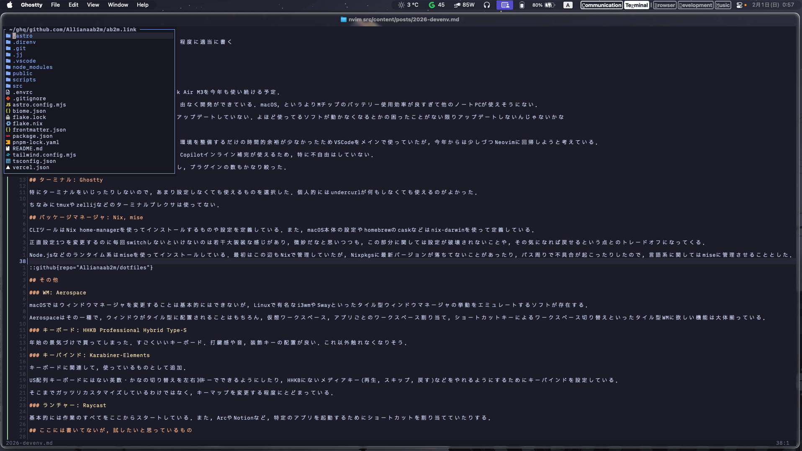
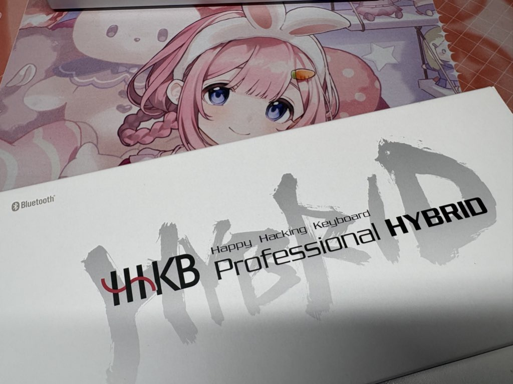

## 開発機/OS: MacBook Air M3, macOS

開発機に関しては，2024年12月に購入したMacBook Air M3を今年も使い続ける予定．

使い始めて約1年が経過したが，今のところ何不自由なく開発ができている．macOS，というよりMチップのバッテリー使用効率が良すぎて他のノートPCが使えそうにない．

ちなみに，macOS 26にはLiquid Glassが嫌なのでアップデートしていない．よほど使ってるソフトが動かなくなるとかの困ったことがない限りアップデートしないんじゃないかな

## エディタ: Neovim

昨年は4月から新しくプロジェクトにジョインし，環境を整備するだけの時間的余裕が少なかったためVSCodeをメインで使っていたが，今年からは少しづつNeovimに回帰しようと考えている．

Neovimでも現代のエディタとして必要なLSP補完やCopilotインライン補完，自動フォーマットやCode Actionが使えるため，特に不自由はしていない．

2026年に入ってから大規模に環境をアップデートし，プラグインの数もかなり絞った．

## ターミナル: Ghostty

特にターミナルをいじったりしないので，あまり設定しなくても使えるものを選択した．個人的にはundercurlが何もしなくても使えるのがよかった．

ちなみにtmuxやzellijなどのターミナルプレクサは使っていない．

## パッケージマネージャ: Nix, mise

CLIツールはNix home-managerを使ってインストールするものや設定を定義している．また，macOS本体の設定やhomebrewのcaskなどはnix-darwinを使って定義している．

正直設定1つを変更するのに毎回switchしないといけないのは若干大袈裟な感じがあり，微妙だなと思いつつも，この部分に関しては設定が破壊されないことや，その気になれば戻せるという点とのトレードオフになってくる．

Node.jsなどのランタイム系はmiseを使ってインストールしている．最初はこの辺もNixで管理していたが，Nixpkgsに最新バージョンが落ちてないことがあったり，パス周りで不具合が起こったりしたので，言語系に関してはmiseに管理させることとした．

この辺はdotfilesレポジトリにまとめている．

::github{repo="Allianaab2m/dotfiles"}

## その他

### WM: Aerospace

macOSではウィンドウマネージャを変更することは基本的にはできないが，Linuxで有名なi3wmやSwayといったタイル型ウィンドウマネージャの挙動をエミュレートするソフトが存在する．

Aerospaceはその一種で，ウィンドウがタイル型に配置されることはもちろん，仮想ワークスペース，アプリごとのワークスペース割り当て，ショートカットキーによるワークスペース切り替えといったタイル型WMに欲しい機能は大体揃っている．

### キーボード: HHKB Professional Hybrid Type-S

年始の景気づけで買ってしまった．すごくいいキーボード．打鍵感や音，装飾キーの配置が良い．これ以外触れなくなりそう．

### キーバインド: Karabiner-Elements

キーボードに関連して，使っているものとして追加．

US配列キーボードにはない英数・かなの切り替えを左右⌘キーでできるようにしたり，HHKBにないメディアキー(再生，スキップ，戻す)などをやれるようにするためにキーバインドを設定している．

そこまでガッツリカスタマイズしているわけではなく，キーマップを変更する程度にとどまっている．

### ランチャー: Raycast

基本的には作業のすべてをここからスタートしている．また，ArcやNotionなど，特定のアプリを起動するためにショートカットを割り当てていたりする．

## ここには書いてないが，試したいと思っているもの

### jj

Gitの代わりになるバージョン管理ツール．Gitとは結構違うマインドセットなので，慣れるまでに時間がかかりそう．

### moonbit

開発環境からは逸れるが，moonbitは結構面白そう．実際のプロダクトに使うのにはもう少しかかりそうだが，ライブラリが整ってくるとTypeScriptに代わる選択肢になりそう．