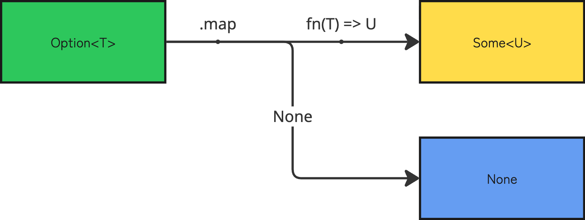
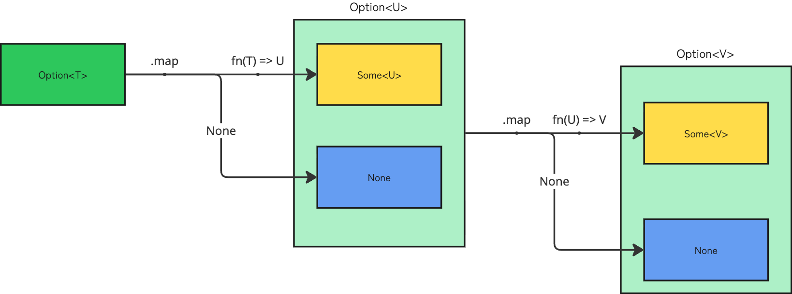
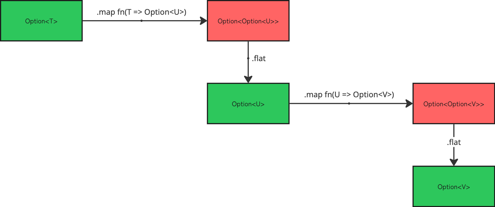
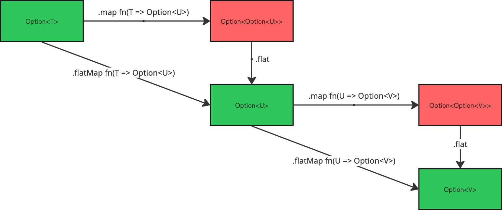

モナドとかモノイドとかそういう話は一旦抜きにして，`.map`や`.flat`，それらの合成である`.flatMap`が何をしているか，何がありがたいのかという話をする．

## 前提

以下のような`Option`型がある想定で進める．
`None`ならば値がないことを示し，`Some(v)`ならば値が存在し，`.value`でアクセスできる．

```ts
type None = { type: 'None' };
type Some<T> = { type: 'Some'; value: T };
type Option<T> = None | Some<T>;

interface OptionFn {
  none: () => Option<never>
  some: <T>(value: T) => Option<T>
  
  isNone: <T>(opt: Option<T>) => opt is None
  isSome: <T>(opt: Option<T>) => opt is Some<T>
}

const OptionFn = {
  none: (): Option<never> => { type: 'None' },
  some: <T>(value: T): Option<T> => ({ type: 'Some', value }),

  isNone: <T>(opt: Option<T>): opt is None => opt.type === 'None',
  isSome: <T>(opt: Option<T>): opt is Some<T> => opt.type === 'Some',
}

```

## .map

`Option`の場合の`.map`関数型はこうなる．

```ts
const map = <T, U>(opt: Option<T>, fn: (v: T) => U): Option<U> => {}
```

`fn`は値を`T`から`U`に変換する関数で，`Option`の中身の値に対して適用したい関数を渡す．

ただ，`Option`型はそもそも「値があるか分からない」という状態であったことを思い出してほしい．`None`に対しては`fn`を適用しないよう実装する必要がある．

```ts
const map = <T, U>(opt: Option<T>, fn: (v: T) => U): Option<U> => {
  if (OptionFn.isNone(opt)) {
    return OptionFn.none()
  }

  return OptionFn.some(fn(opt.value))
}
```

これで`Some`の時だけ`fn`が適用されるようになった．図に起こすとこんな感じ．



これで何が嬉しいかというと，`.map`関数のチェーンのみで値の存在を途中で確認せずとも値に対しての処理が行えるという点である．

`None`の時は処理がスキップされるので，`.map`関数の呼び出し側は渡される値が常に`Some`であるときのことだけを考えていればよくなり，値の取り出しは最後の最後まで引っ張ることができる．

```ts
const mayFail = <T>(value: T) => Math.random() > 0.5 ? OptionFn.some(value) : OptionFn.none();

const opt1: Option<number> = mayFail(100)
const opt2: Option<number> = OptionFn.map(opt1, (v) => v * 2)
const opt3: Option<string> = OptionFn.map(opt2, (v) => v.toString()) 
//    ^? = Some("200") or None
```

ただ，実際こういったコードを書く場合は，一度`Option`に入った値を変換していくのではなく，`Option`に入った値をさらに`Option`を返す関数に渡して処理を継続したいことが殆どだろう．つまり，`fn`の返り値が`Option`になる場合である．

それを`.map`だけでやろうとすると`Option`のネストが起こり，こうなってしまう．

```ts
const mayFail = <T>(value: T) => Math.random() > 0.5 ? OptionFn.some(value) : OptionFn.none();

const opt1: Option<number> = mayFail(100)
const opt2: Option<Option<number>> = OptionFn.map(opt1, (v) => mayFail(v * 2))
const opt3: Option<Option<Option<string>>> = OptionFn.map(opt2, (v) => OptionFn.map(v, (x) => mayFail(x.toString())))
```



これでは不便なので，入れ子になった`Option`には次の`.flat`関数を適用することになる．

## .flat

`.flat`関数は，その名の通りコンテナ[^1]で入れ子になった値をフラットにしてくれる役割を持つ．

```ts
const flat = <T>(opt: Option<Option<T>>): Option<T> => {
  if (OptionFn.isNone(opt)) {
    return OptionFn.none();
  }

  return opt.value; 
}
```

これを先のネストしまくった`Option`型の例に当てはめると，このようになる．

```ts
const opt1: Option<number> = mayFail(100)
const opt2: Option<number> = OptionFn.flat(OptionFn.map(opt1, (v) => mayFail(v * 2)))
const opt3: Option<string> = OptionFn.flat(OptionFn.map(opt2, (v) => mayFail(v.toString())))
```



ただ，`.flat`関数をそのまま使うことはあまりない．なぜなら，このような`.flat`と`.map`を組み合わせて使うパターンは頻出するため，`.flat`と`.map`を合成した`.flatMap`関数が定義されていることがほとんどだからだ．

## .flatMap

ということで，`.flatMap`関数は`.flat`と`.map`の合成関数である．

実装もこれら2つの関数を組み合わせたような実装になっている．

```ts
const flatMap = <T, U>(opt: Option<T>, fn: (v: T) => Option<U>): Option<U> => {
  if (OptionFn.isNone(opt)) {
    return OptionFn.none();
  }
  
  return fn(opt.value)
}
```



```ts
const opt1: Option<number> = mayFail(100)
const opt2: Option<number> = OptionFn.flatMap(opt1, (v) => mayFail(v * 2))
const opt3: Option<string> = OptionFn.flatMap(opt2, (v) => mayFail(v.toString()))
//    ^? = Some("200") or None
```

もし，同じような内容を`.flatMap`なしで書く場合は次の処理を呼ぼうとするたびに値があるかどうかをチェックして連続させる必要があり，非常に面倒である．

```ts
const opt1: Option<number> = mayFail(100)

if (OptionFn.isNone(opt1)) {
  return
}

const opt2: Option<number> = mayFail(opt1.value * 2)

// こんな感じのif文がずっと続く
```

このように，失敗するかもしれない処理(=`Option`が入れ子になるような処理)を連続で行う場合は`.flatMap`関数が活躍する．

今回はOption型を例にとってみたが，Promiseを同じようにラップした型や`Result`型を用意しても同じように実装できる．[^2]

「失敗しうる計算を連続させる」という処理はある程度のプログラムであれば必ずといっていいほど発生する．

そういった処理を小さな処理を行う関数の合成だけでシンプルかつ安全に実装できるのは関数型・静的型プログラミングの魅力の一つだと私は考えている．

[^1]: Option型に限らず，Result型やPromise型など，値を何かしらでラップしている型をコンテナ型と言うことがある

[^2]: このように，ある条件を満たした型に適用できる共通した処理や操作のパターンこそがモナドである，という認識でいいと思う