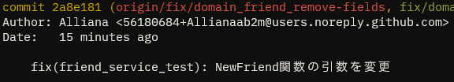

GitHubはコミットとGitHub上のアカウントを紐づけするために，コミットの`user.name`と`user.email`を確認し，表示している．



もし仮に，誰かが`user.email`に`5618…@users.noreply.github.com`を指定してコミットした場合，GitHub上ではあたかも私が行ったコミットかのように表示される．

参考：

[Git でコミット作成者を偽装する方法／署名付きコミットでの対策 - Qiita](https://qiita.com/s6n/items/bb869f740a53a3bf169e)

このように，いとも簡単に他人になりすませてしまうため，Gitではコミットに対して署名をすることでその操作が間違いなく本人によって実行されたということを証明することができる．

また，GitHubでは署名が検証されたコミットにVerifiedラベルを付与している．


先の記事にもある通り，以前までこの署名はGPG鍵を生成し，GitHubに別途登録する必要があった．

このGPG鍵というのがなかなかとっつきづらく，管理もしづらい．

「Verified付いてるのかっこいいからやってみたい！」みたいな軽いノリでやる[^1]にはハードルが高かった．

[^1]: 3年ほど前の私．当時の私はGPGへの知識が無く，失効証明書を配布せずに主鍵を失効させたという黒歴史がある．

2年ほど前からGitHubはSSH鍵で署名されたコミットに対しても検証を行えるようになった．

SSH鍵であれば，GitHubへPush/Pullしたりするのに使っている人も多いはず．これであれば新たに鍵を生成することもなく，手軽にコミット署名をすることができる．

## で，どうやんのさ

1. `~/.ssh/id_ed25519.pub`(公開鍵)の中身をコピー
2. https://github.com/settings/keys にアクセス
3. 適当にタイトルを設定，さっきコピーした公開鍵を貼り付ける
4. Gitにも署名の設定をする
    
```bash
git config --global gpg.format ssh # SSH鍵で署名する
git config --global user.signingkey ~/.ssh/id_ed25519.pub # 署名に使う鍵を指定
git config --global commit.gpgsign true # 常に署名を行う設定(falseの場合，commit時毎回-Sフラグが必要)
```
    

以上で設定は完了．正しく設定できていれば，コミットに署名が行われ，GitHub上でVerifiedフラグが付いていることが確認できるはず．

## 参考記事

[GitのコミットにSSH鍵で署名してGitHub上でVerifiedマークをつけよう！ - Qiita](https://qiita.com/tonnsama/items/c938b220b57e828cd288)

[コミット署名の検証について - GitHub Docs](https://docs.github.com/ja/authentication/managing-commit-signature-verification/about-commit-signature-verification)
