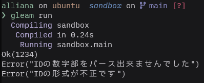

Gleamは`if`/`else`文・式や`return`といった構文を持たないので，caseとパターンマッチングのみで条件分岐を表現し，関数の最後の式で評価された値を返り値とする．なかなかに思想が強い．

例として，何かしらのIDをバリデーションしたい場面があったとする．

IDの形式は`ID-XXXX`(Xは数字)とし，成功したらIDの数字部分をパースしたものを，失敗したらフォーマットが不正というエラーを返すような形にする．

仮にcaseだけを使って書くとしたら，このような見た目になる．

```gleam
const id_prefix = "ID-"
fn validate_id(str: String) -> Result(Int, String) {
	case str |> string.startswith(id_prefix) {
        True -> {
			case str |> string.replace(id_prefix, "") |> int.parse {
				Ok(value) -> Ok(value)
				Error(_) -> Error("IDの数字部をパース出来ませんでした")
			}
		}
		False -> Error("IDの形式が不正です")
	}
}
```

```gleam
pub fn main() {
	validate_id("ID-1234")
	|> io.debug
	
	validate_id("ID-ABCD")
	|> io.debug
	
	validate_id("1234")
	|> io.debug
}
```



これでも動くことには動くが，今後IDに桁数の制約やその他の条件が増えたりした場合，`case`がどんどんネストしていき，コードが絶望的に見にくくなるだろう．


それと，6行目の`Ok(value) -> Ok(value)`もなんだか冗長な気がする．というか正しい値を返す文は分岐の真ん中ではなく，一番最後に置きたい(これは思想の問題かもしれないが)．

こうなるとEarly-returnしたくなる．が，Gleamには`if`も`else`も`return`もないのである！

どうしたものか…と悩んでいたところ，`bool.guard`という関数があることを知った．

[GleamのTips#66685d444293a40000d73ba3](https://scrapbox.io/gleam-jp/Gleam%E3%81%AETips#66685d444293a40000d73ba3)

[gleam/bool · gleam_stdlib · v0.40.0](https://hexdocs.pm/gleam_stdlib/gleam/bool.html#guard)

> Run a callback function if the given bool is `False`, otherwise return a default value.
>
> With a `use` expression this function can simulate the early-return pattern found in some other programming languages.

関数の説明にも`early-return`と記述がある．読み進めると

> **In a procedural language:**
> 
> 
> ```js
> if (predicate) return value;
> // ...
> ```
> 
> **In Gleam with a `use` expression:**
> 
> ```gleam
> use <- guard(when: predicate, return: value)
> // ...
> ```
> 

とあり，一般的な手続き型言語におけるEarly-returnのように使えるようだ．

早速これで最初の例を書き換えてみる．

```gleam
fn validate_id(str: String) -> Result(Int, String) {
	use <- bool.guard(
		str |> string.starts_with(id_prefix) |> bool.negate,
		Error("IDの形式が不正です")
	)
	
	use id_num <- result.try(
		str
		|> string.replace(id_prefix, "")
		|> int.parse
		|> result.replace_error(
			"IDの数字部をパース出来ませんでした"
		),
	)
	
	Ok(id_num)
}
```

若干の書き換えはあったものの，最初の例と比べて，

- インデントが浅くなった
- エラーを最初に蹴ることで関数の一番最後に正しい値を持ってこれた

ことによりコードの見通しが良くなった．

めでたしめでたし．

---

…なぜこんなことが出来たのか？use周りの理解が浅かったのでいろいろと調査した．

use式より後ろに書かれたコードはuseで展開した関数(ここでは`gleeting()`)のコールバック関数(`name: fn() → String`)の中に渡される．

```gleam
fn gleeting(name: fn() -> String) -> Nil {
	let message = "Hello " <> name() <> "!"
	io.println(message)
}

pub fn main() {
	use <- gleeting()
	"Gleam"
}
```

このとき，`use <- gleeting()`より後ろに書かれた”Gleam”という文字列は単なる文字列としてではなく，`fn () { “Gleam” }`という無名関数になり，gleeting関数のname引数にコールバック関数として渡される．

また，useは式なので，useで展開した関数のコールバックはブロックに囲むことで変数に束縛したり，囲まずにそのままにして関数の返り値とすることもできる．

```gleam
fn gleeting(name: fn() -> String) -> String {
	"Hello " <> name() <> "!"
}

pub fn main() {
	let message = {
		use <- gleeting()
		"Gleam"
	}
	io.println(message)
}
```

ここでは，上の例のgleeting関数の返り値を`Nil`から`String`にし，そのコールバックを変数に束縛している．

---

さて，`bool.guard`に話を戻す．`bool.guard`はこのように定義されている．

```gleam
pub fn guard(
	when requirement: Bool,
	return consequence: t,
	otherwise alternative: fn() -> t,
) -> t {
	case requirement {
		True -> consequence
		False -> alternative()
	}
}
```

`when`(`requirement`)が

- Trueの時にはコールバックは実行**されず**，`return`(`consequence`)引数に渡された値を
- Falseの時にはコールバック(`otherwise()`)を実行しその返り値を

それぞれ返す．

Trueの時にコールバックを実行しないで値を返すことで，Early-returnを実現しているということだった．

敢えてuseを使わずに同じ動作をするコードを書いた場合，このような見た目になる．

```gleam
bool.guard(
	when: str |> string.starts_with(id_prefix) |> bool.negate,
	return: Error("IDの形式が不正です"),
	otherwise: fn() {
		result.try(
			str
				|> string.replace(id_prefix, "")
				|> int.parse
				|> result.replace_error(
					"IDの数字部をパース出来ませんでした"
				),
			apply: fn(id_num) { Ok(id_num) },
		)
	}
)
```

useを使うことで，コールバックに渡している処理をネストすることなく書ける，というカラクリだった．

だいぶ寄り道した感があったが，Gleamへの理解がより深まった．

## 参考

[Gleamのuseについて](https://zenn.dev/comamoca/articles/gleam-use-syntax)
[GleamのTips#66685d444293a40000d73ba3](https://scrapbox.io/gleam-jp/Gleam%E3%81%AETips#66685d444293a40000d73ba3)
