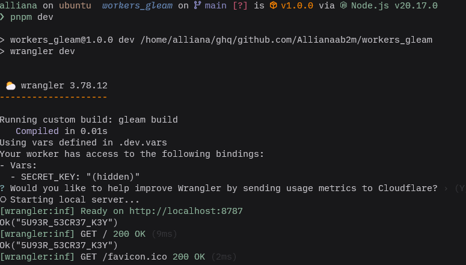

[Gleam](https://gleam.run)という静的型付け・関数型言語がある．

::github{repo="gleam-lang/gleam"}

Erlang VMやJavaScriptランタイムで動くようコンパイルされるのが特徴．

今回は，「JavaScriptにトランスパイルできる」というところに注目し，Cloudflare WorkersでGleamを動かしてみた．

## 環境構築

依存関係にgleam_javascriptを追加する．

また，ローカルでの動作確認・デプロイ用に`wrangler`をインストールする．

```bash
gleam new workers_gleam
cd workers_gleam
gleam add gleam_javascript
pnpm init
pnpm add -D wrangler
```

`gleam.toml` を編集．targetにJavaScriptを指定した．

```toml
name = "workers_gleam"
version = "1.0.0"
target = "javascript"

[dependencies]
gleam_stdlib = ">=0.34.0 and < 2.0.0"
gleam_javascript = ">=0.12.0 and < 1.0.0"

[dev-dependencies]
gleeunit = ">= 1.0.0 and < 2.0.0"
```

また，`wrangler.toml`を以下のように記述する．

```toml
name = "workers-gleam"
main = "build/dev/javascript/workers_gleam/index.js"
compatibility_date = "2023-09-22"

[build]
command = "gleam build"
```

## GleamとJavaScriptをFFIで繋ぐ

GleamはJavaScriptやErlangと相互に運用できるため，FFIの仕組みが備わっている．

ここでは，JavaScriptで定義されている`Response`や`Request`といったオブジェクトをGleamでも使えるようにしていく．

まずは`src/ffi.js`にresponse, method, url, bodyを追加する．

```js
export function response(status, headersList, body) {
  let headers = new Headers()
  for (let [k, v] of headersList) headers.append(k, v)
  return new Response(body, { status, headers })
}

export function method(request) {
  return request.method
}

export function url(request) {
  return request.url
}

export function body(request) {
  return request.body
}
```

`src/cloudflare/workers.gleam`でffi.jsで書いた関数とGleamの関数を結びつける．

```gleam
pub type Request

pub type Response

pub type Environment

pub type ExecutionContext

@external(javascript, "../ffi.js", "response")
pub fn response(
  status: Int,
  headers: List(#(String, String)),
  body: String,
) -> Response

@external(javascript, "../ffi.js", "method")
pub fn method(req: Request) -> String

@external(javascript, "../ffi.js", "url")
pub fn url(req: Request) -> String

@external(javascript, "../ffi.js", "body")
pub fn body(req: Request) -> String
```

これでGleam側で`response`や`method`を実行したときには，JavaScript側の関数を呼び出すようになった．

## ハンドラーを作る

これらの型や関数を使ってハンドラーを書く．

handle_requestはJavaScriptの`Promise<Response>`を返さなければならないため，返り値を`Promise(Response)`としている．

また，`promise.resolve`に渡すことで`response`を`Promise`でラップしている．

```js
import cloudflare/workers.{type Request, type Response}
import gleam/javascript/promise.{type Promise}

pub fn handle_request(
  _request: Request,
) -> Promise(Response) {
  workers.response(200, [], "Cloudflare Workers上でGleamが動いてるよ")
  |> promise.resolve
}
```

## エントリポイントを作る

最後にCf Workers用のエントリポイントを作る．`src/index.js`の中に書いていく．

```js
import { handle_request } from "./workers_gleam.mjs"

export default {
	async fetch(request) {
		return handle_request(request)
	}
}
```

一行目でimportしている`workers_gleam.mjs`はビルド時に`src/workers_gleam.gleam`から生成されるJavaScriptモジュールで，Gleamで定義した`handle_request`がそのままJavaScriptの関数としてexportされている．

```js
import * as $promise from "../gleam_javascript/gleam/javascript/promise.mjs";
import * as $workers from "./cloudflare/workers.mjs";
import { toList } from "./gleam.mjs";

export function handle_request(_) {
  let _pipe = $workers.response(200, toList([]), "Cloudflare Workers上でGleamが動いてるよ");
  return $promise.resolve(_pipe);
}
```

## Envを使う

Cf Workersではfetch関数の第二引数に`env`を受け取る．Cf Workersに設定した環境変数がKey-Value形式で格納されたオブジェクトになっている．

.dev.varsに環境変数を追加する．

```text
SECRET_KEY=5U93R_53CR37_K3Y
```

この値をGleamから取り出して使う．

ffi.jsに新たに`read_environment(env, key)`関数を用意するが，この関数はGleamのResult型を返すようにする．

値が存在すればOk，無ければErrorを返すようにしておけば，Gleamからは安全にEnvの値にアクセスすることが出来るためである．

JavaScriptからGleamの機能にアクセスするには，`./gleam.mjs`をインポートする．`gleam.mjs`もビルド時に生成され，Gleamの一部機能をJavaScriptから使えるようになっている．

```js
import { Ok, Error as Err } from "./gleam.mjs"

export function read_environment(env, key) {
	const value = env[key]
	return value ? new Ok(value) : new Err(undefined)
}
```

`src/cloudflare/workers.gleam`に`read_environment`を追加する．

```gleam
@external(javascript, "../ffi.js", "read_environment")
pub fn read_environment(env: Environment, key: String) -> Result(String, Nil)
```

ハンドラーで呼び出す．

```js
import cloudflare/workers.{type Environment, type Request, type Response}
import gleam/io
import gleam/javascript/promise.{type Promise}

pub fn handle_request(_request: Request, env: Environment) -> Promise(Response) {
  let _ =
    workers.read_environment(env, "SECRET_KEY")
    |> io.debug

  workers.response(200, [], "Cloudflare Workers上でGleamが動いてるよ")
  |> promise.resolve
}
```

エントリポイントもEnvを受け取るように変更する．

```js
import { handle_request } from "./workers_gleam.mjs"

export default {
  async fetch(request, env) {
    return handle_request(request, env)
  }
}
```

実行すると，ログに設定した環境変数が表示される．



---

FFIコードを書かなければならないものの，GleamをCf Workersで動かせることが分かった．

KVやR2などのBindingsが使えないかどうか，今後も調査を進めていきたい．

この記事を書いている最中に，Deno DeployやCloudflare Workersでも動かせる[Glen](https://hexdocs.pm/glen)というGleam製フレームワークを発見した．

実際にCf Workersに載せるなら，自力でFFIを頑張るのではなく，このようなフレームワークを使うのが良いだろう．

::github{repo="MystPi/glen"}

## 参考

::github{repo="lpil/gleam-cloudflare-worker"}
