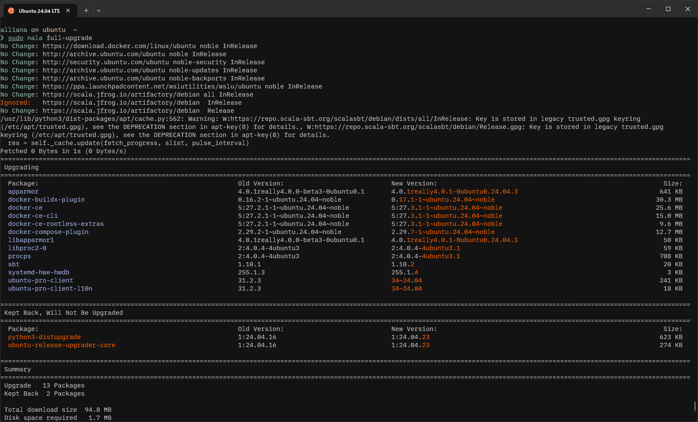
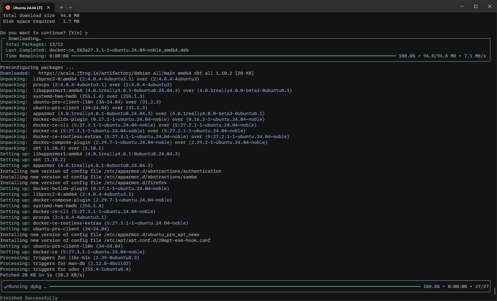
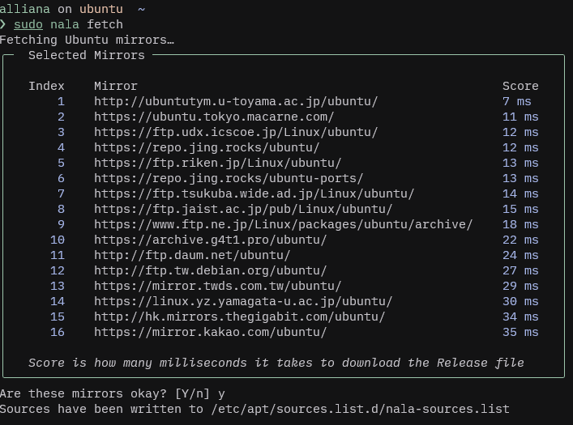

`nala`は`libapt-pkg`のフロントエンドで，`apt`の代替として機能する．

`nala`は

> Especially for newer users it can be hard to understand what `apt` is trying to do when installing or upgrading.

と[言っている](https://github.com/volitank/nala?tab=readme-ov-file#-nala)通り，`apt`の分かりづらいUIをより綺麗で分かりやすいものに置き換えることがプロジェクトの目的の一つになっている．





`apt`と比較して，スッキリとした分かりやすいUIをしていることが分かる．

コマンドに関しては`apt`と全く同じで，インストールするだけですぐに使える．

また，`apt`を置き換えることもしないため，共存することができる．

```bash
sudo apt install nala

sudo nala install <packageName>
sudo nala update && sudo nala upgrade -y
```

他には

- 並列ダウンロードが有効
- `nala fetch`で最速のミラーサーバーを探してそれを使うよう設定できる

など，aptには無い機能も追加されている．



Ubuntu/Debianユーザーならぜひ一度使ってみてほしい．
