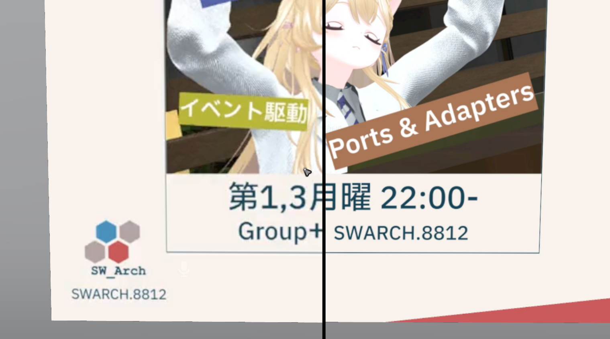

VRChat 内で LT をする場合，スライドを書き出した PDF 内のページを2秒ずつ送る動画形式にする必要がある．

これは VRChat 内のスライドシステムとして実装されているアセットのほとんどが動画プレイヤーの仕組みを用いており，スライド送りの機能は，オフセットを2秒ずつ動かすという方法で実装されているためである．

PDF を突っ込めばスライドシステムで読み込める形式の動画を生成し，リンクを発行してくれる Web サービスもあるにはあるが，以下の理由から後述の `ffmpeg` を用いた方法でスライド動画を生成した．

- 画質の劣化が激しい
- 生成される URL が長い
- たまに生成が失敗するなど，動作が安定していない
  - 開発者のことは知ってはいるが，ファイルを入れるのはどことなく不安

## 手順1. PDF ファイルを用意する

まずはスライドの内容を書き出した PDF ファイルを用意する．

私は Marp を使っているため，Marp を用いて PDF を生成した．

## 手順2. PDF ファイルを動画に変換する

スライドの PDF ファイル名が `slide.pdf` であるとして，以下のコマンドを実行する．

コマンドの内容を少し解説すると，`pdftoppm` は PDF ファイルのページの1枚1枚を PNG ファイルとして書き出すコマンド．解像度はスライドシステム内で綺麗に表示するために 4K で書き出している．

`ffmpeg` はその生成された PNG ファイルを1枚あたり2秒表示する動画に変換している．

```bash
pdftoppm -png -scale-to-x 3840 -scale-to-y 2160 slide.pdf slide
ffmpeg -framerate 1/2 -i slide-%02d.png -s 3840x2160 -r 60 -c:v libx264 -pix_fmt yuv420p -profile:v baseline slide.mp4
```

## 手順3. オブジェクトストレージに突っ込む

あとはこれで生成された動画ファイルをオブジェクトストレージに格納し，URL を得る．

今回の用途では Cloudflare R2 が 10GB 分のストレージを持っているため，これを利用することにした．

自分でファイル名を決めるので，衝突の心配がない．また，R2 に独自ドメインを当てることで，スライドを表示するための URL はとても短くなる．

## 手順4. ここまでの手順を GitHub Actions で自動化する

あとはここまでの手順を GitHub Actions にやらせることで， Markdown を main に push するだけでスライドデータが用意できるようになる．

この仕組み自体は GitHub Actions と Cloudflare R2 を用いた簡易的なものであるため，使ってみたい場合はご自身のアカウントで同じような環境を構築し，ワークフローを書くことで実現できる．

## 見た目の違いに関して

実際どれぐらい見た目が違うのか実際に検証した．ちなみに私は画像処理系に関しては門外漢なので，主観ベースでしかお話できないことを予め断っておく．

左は Web Screen を用いて PDF を動画に変換したもの，右は今回の手法で動画に変換したもの．



今回の手法で出力した場合のほうが，全体的に文字のぼやけがなく，クリアに表示されていることがわかる．

## 謝辞

[えー](https://github.com/a1678991)さんから手順2で示した動画化コマンドとアイデアを頂きました．ありがとうございました．